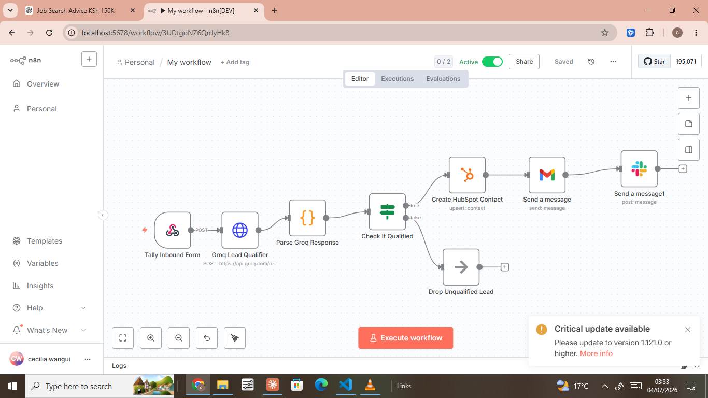
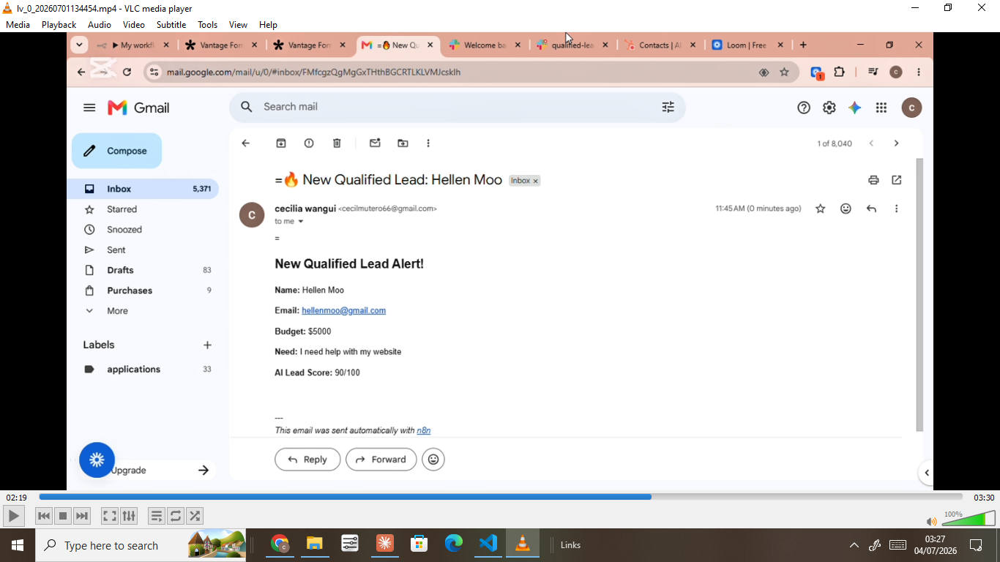
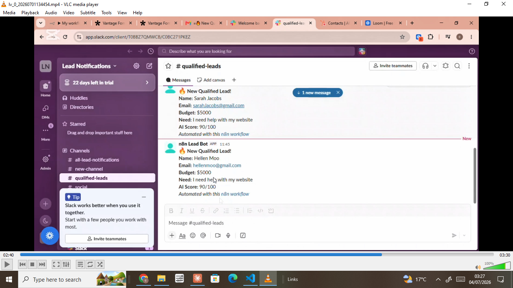
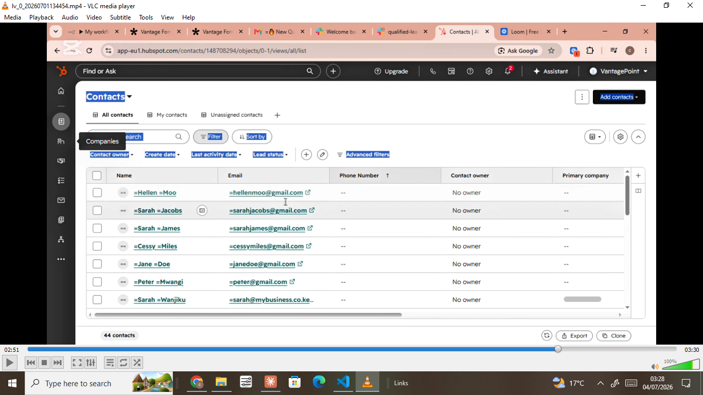

# 🤖 AI Lead Qualification System
### Built by [Cecilia Wangui Mutero](https://www.linkedin.com/in/ceciliawangui) | AI Automation Engineer

## 📸 Screenshots

### n8n Workflow Canvas


### Gmail Notification


### Slack Alert


### HubSpot Contact Auto-Created

---

## 📌 What This System Does

A fully automated, end-to-end **AI-powered lead qualification pipeline** that:

- ✅ Captures inbound leads from a Tally web form via webhook
- ✅ Uses **Groq LLaMA 3.1** AI to score and qualify each lead (1–100)
- ✅ Routes qualified leads to **HubSpot CRM** automatically
- ✅ Sends instant **Gmail email notifications** with full lead details
- ✅ Posts real-time **Slack alerts** to the `#qualified-leads` channel
- ✅ Silently drops unqualified leads with zero manual intervention
- ✅ Runs **24/7 on autopilot** — zero human involvement required

> **All tools used are on free tiers. Total infrastructure cost: $0.**

---

## 🏗️ Architecture Overview

```
┌─────────────────┐
│   Tally Form    │  ← Lead submits inbound form
└────────┬────────┘
         │ POST webhook
         ▼
┌─────────────────┐
│ n8n Webhook     │  ← Receives and parses form data instantly
│ (Trigger Node)  │
└────────┬────────┘
         │
         ▼
┌─────────────────┐
│  Groq LLaMA 3.1 │  ← AI scores lead 1-100 based on need + budget
│  AI Qualifier   │     Returns: { status, lead_score }
└────────┬────────┘
         │
         ▼
┌─────────────────┐
│  Parse + Extract│  ← Cleans AI response, extracts contact fields
│  (Code Node)    │
└────────┬────────┘
         │
         ▼
┌─────────────────────────────────┐
│     Check If Qualified          │  ← Routes based on AI decision
│     (If Node)                   │
└──────┬──────────────────┬───────┘
       │ TRUE             │ FALSE
       ▼                  ▼
┌──────────────┐   ┌──────────────┐
│ HubSpot CRM  │   │  Drop Lead   │  ← Silently discarded
│ Create Contact│  │  (No-Op)     │
└──────┬───────┘   └──────────────┘
       │
       ▼
┌──────────────┐
│ Gmail Alert  │  ← Full lead details + AI score emailed instantly
└──────┬───────┘
       │
       ▼
┌──────────────┐
│ Slack Alert  │  ← Team notified in #qualified-leads channel
└──────────────┘
```

---

## 🛠️ Tech Stack

| Tool | Role | Cost |
|------|------|------|
| **n8n** | Workflow orchestration engine | Free (self-hosted) |
| **Tally** | Inbound lead capture form | Free tier |
| **Groq (LLaMA 3.1 8B Instant)** | AI lead scoring engine | Free tier |
| **HubSpot** | CRM — contact creation | Free tier |
| **Gmail** | Email notification delivery | Free |
| **Slack** | Team alert channel | Free tier |
| **ngrok** | Webhook tunneling (dev) | Free tier |

---

## 🧠 How the AI Qualification Works

The Groq LLaMA 3.1 model acts as a strict qualification engine. It receives:
- The lead's **stated need** (what they want help with)
- Their **declared budget**

And returns a clean JSON object:
```json
{
  "status": "qualified",
  "lead_score": 87
}
```

**Qualification rules:**
- Budget **above $500** + clear business need = `qualified`
- Vague need or budget **below $500** = `unqualified`
- Score range: **1–100** (higher = stronger lead)

The AI prompt is engineered to return **raw JSON only** — no markdown, no explanations, no filler text.

---

## 📋 Prerequisites

- [n8n](https://n8n.io) installed (self-hosted or cloud)
- [Groq API key](https://console.groq.com) (free)
- [HubSpot account](https://hubspot.com) (free CRM)
- [Tally account](https://tally.so) (free forms)
- [Slack workspace](https://slack.com) (free)
- Gmail account with OAuth2 enabled
- [ngrok](https://ngrok.com) for local webhook tunneling

---

## 🚀 Setup Instructions

### 1. Clone This Repository
```bash
git clone https://github.com/CeciliaMutero/ai-lead-qualification-system.git
cd ai-lead-qualification-system
```

### 2. Import the n8n Workflow
1. Open your n8n instance at `http://localhost:5678`
2. Click **+** → **New Workflow**
3. Click the three-dot menu → **Import from JSON**
4. Paste the contents of `workflow.json` → click **Import**

### 3. Configure Credentials

#### Groq API Key
1. Go to [console.groq.com](https://console.groq.com) → API Keys → Create
2. In n8n: **Groq Lead Qualifier** node → Authentication → Header Auth
   - Name: `Authorization`
   - Value: `Bearer YOUR_GROQ_KEY`

#### HubSpot Private App
1. Go to HubSpot → Settings → Integrations → Private Apps → Create
2. Add scopes: `crm.objects.contacts.write`, `crm.objects.contacts.read`
3. Copy the token → paste into n8n HubSpot credential

#### Gmail OAuth2
1. Go to [Google Cloud Console](https://console.cloud.google.com)
2. Enable Gmail API
3. Create OAuth2 credentials → connect in n8n

#### Slack Bot Token
1. Go to [api.slack.com/apps](https://api.slack.com/apps) → Create App
2. Add scopes: `chat:write`, `chat:write.public`, `channels:read`
3. Install to workspace → copy Bot Token (`xoxb-...`) → paste into n8n

### 4. Set Up Tally Form
Create a Tally form with exactly these fields:
| Field Label | Field Type |
|---|---|
| `Name` | Short answer |
| `Email` | Email |
| `What do you need help with?` | Long answer |
| `Budget` | Short answer |

### 5. Connect Tally Webhook
1. Start ngrok: `./ngrok http 5678`
2. Copy your ngrok URL (e.g. `https://abc123.ngrok-free.app`)
3. In Tally → Integrate → Webhooks → Add endpoint:
   ```
   https://abc123.ngrok-free.app/webhook/inbound-leads
   ```

### 6. Activate the Workflow
1. In n8n, toggle the workflow **Active** (top right)
2. Submit a test form entry
3. Watch the pipeline execute end-to-end ✅

---

## 📊 Live Demo Results

### ✅ Qualified Lead Test
**Input:**
```
Name: Hellen Moo
Email: hellenmoo@gmail.com
Need: I need help with my website
Budget: $5000
```

**AI Response:**
```json
{ "status": "qualified", "lead_score": 90 }
```

**Outcome:**
- ✅ HubSpot contact created automatically
- ✅ Gmail notification sent with full details + AI score
- ✅ Slack alert posted to #qualified-leads

---

### ❌ Unqualified Lead Test
**Input:**
```
Name: Waa Ree
Email: waaree@gmail.com
Need: I need help with hubspot
Budget: $55
```

**AI Response:**
```json
{ "status": "unqualified", "lead_score": 25 }
```

**Outcome:**
- ❌ No HubSpot contact
- ❌ No Gmail notification
- ❌ No Slack alert
- ✅ Lead silently dropped

---

## 📁 Repository Structure

```
ai-lead-qualification-system/
│
├── workflow.json          # Complete n8n workflow (import-ready)
├── README.md              # This file
├── screenshots/
│   ├── n8n-canvas.png     # Full workflow view
│   ├── gmail-alert.png    # Email notification sample
│   ├── slack-alert.png    # Slack message sample
│   └── hubspot-contact.png # CRM contact created
└── docs/
    └── setup-guide.md     # Detailed setup instructions
```

---

## 🎬 Portfolio Demo

> 📹 [Watch the full live demo video](YOUR_LOOM_LINK_HERE)

The demo shows:
1. Live Tally form submission
2. n8n workflow executing in real-time
3. Gmail notification arriving instantly
4. Slack alert posting to the team channel
5. HubSpot contact automatically created
6. Unqualified lead correctly dropped with zero notifications

---

## 🔧 Customization Options

This system can be extended to support:

- **WhatsApp notifications** via Twilio or WhatsApp Cloud API
- **Calendar booking** via Google Calendar integration
- **SMS alerts** via Africa's Talking API
- **Multi-step AI qualification** with follow-up questions
- **Lead scoring dashboard** via Google Sheets or Airtable
- **CRM pipeline automation** — move leads through HubSpot deal stages automatically
- **Industry-specific scoring** — tune AI prompt for clinics, real estate, salons, etc.

---

## 💼 Built For

This system is ideal for:
- **Service businesses** (clinics, salons, law firms, real estate agents)
- **Freelancers** managing multiple client inquiries
- **Sales teams** who waste time on unqualified prospects
- **Startups** that need automated lead management without expensive CRM tools

---

## 👩‍💻 About the Author

**Cecilia Wangui Mutero** — Full-Stack Engineer & AI Automation Specialist based in Nairobi, Kenya.

Specializing in:
- AI workflow automation (n8n, Groq, LangChain)
- Voice AI agents (Vapi.ai, ElevenLabs)
- Full-stack development (Next.js, FastAPI, Django)
- CRM integrations (HubSpot, Airtable, Google Sheets)

📧 cecilmutero66@gmail.com  
🔗 [LinkedIn](https://www.linkedin.com/in/ceciliawangui)  
🐙 [GitHub](https://github.com/CeciliaMutero)  

> *Available for freelance automation projects and full-time remote roles.*

---

## 📄 License

MIT License — feel free to use, modify, and build on this project.

---

⭐ **If this project helped you, please give it a star!**
```